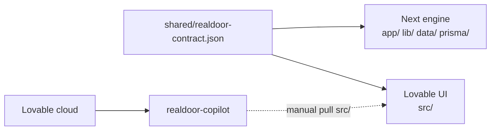

# RealDoor Codebase Guide

**Last surveyed:** 2026-07-19  
**Canonical repo:** [DiggityDooo/HackNationProto](https://github.com/DiggityDooo/HackNationProto)  
**Active branch (this workspace):** `lovable/realdoor-ui`  
**Product:** Renter-side Application-Readiness Copilot for one frozen metro, program, and rule year.

This document explains the whole repository: what the product is, how the two apps fit together, where every major path lives, how data and safety work, and what is still drifted or incomplete.

---

## 1. What RealDoor is

RealDoor helps renters prepare affordable-housing application packets. It:

1. Extracts only allowlisted fields from **synthetic** documents.
2. Requires the renter to confirm or correct every field before reuse.
3. Explains frozen published rules with citations and deterministic math.
4. Flags missing or expired checklist items.
5. Builds a renter-controlled preview/export packet.

It is **assistive, not adjudicative**. It never approves, denies, scores, ranks, or determines eligibility. The renter confirms. A qualified human decides.

Challenge source of truth: `1784383492519-03-RealPage-RealDoor.docx.pdf`.

### Frozen demo context (product truth)

| Setting | Value |
|---------|-------|
| Geography | Boston-Cambridge-Quincy, MA-NH HMFA |
| Program | LIHTC (MTSP income limits) |
| Rule year | FY2026 |
| Effective date | 2026-05-01 |
| Simulation date | 2026-07-18 |
| Evidence currency | 60 days |
| Default AMI band | 60% |
| Demo households | HH-003 Avery Moss (default), HH-005 Tess Alder (expired), HH-002 Jonas Vale (injection) |

**Canonical constants file:** `shared/realdoor-contract.json`

60% AMI annual limits (household size 1–8):  
72,000 · 82,320 · 92,580 · 102,840 · 111,120 · 119,340 · 127,560 · 135,780

---

## 2. Dual-app architecture (read this first)

This repo contains **two sibling applications** that must stay aligned but must **not** share one runtime.

| App | Paths | Stack | Owns |
|-----|-------|-------|------|
| **Engine** | `app/`, `components/`, `lib/`, `data/`, `prisma/`, `tests/` | Next.js 15 App Router | Extraction, rules math, Prisma sessions, safety guards, Vitest |
| **UI prototype** | `src/` | Lovable / TanStack Start + Vite | Welcome, Discover→Prepare UX, RealDoor Guide, 3D avatar, export UX |
| **Shared contract** | `shared/` | JSON | Frozen geography, MTSP limits, scenarios, allowlists, safety copy |

One root `package.json` hosts both script sets. Separate TypeScript configs:

- `tsconfig.next.json` → Next engine (`npm run typecheck`)
- `tsconfig.json` → Lovable UI (`npm run typecheck:lovable`)

### Sync rule (non-negotiable)

1. Edit `shared/realdoor-contract.json` first for geography, limits, dates, or field names.
2. Align engine: `data/config.json` + `lib/`.
3. Align UI: `src/lib/realdoor-contract.ts` / `src/lib/realdoor-data.ts` (or prompt Lovable).
4. Run `npm run test`.

### Git remotes

| Remote | Repo | Role |
|--------|------|------|
| `origin` | `DiggityDooo/HackNationProto` | Canonical. `main` ≈ engine; `lovable/realdoor-ui` ≈ engine + UI |
| `lovable` | `DiggityDooo/realdoor-copilot` | Lovable auto-sync mirror (UI `src/` only) |

Lovable cloud project: **RealDoor Copilot** (`8c39b55a-c517-4512-9f7e-7ecd8dc147d0`).  
Lovable pushes to `realdoor-copilot`, not into HackNationProto automatically. Merge `src/` into `lovable/realdoor-ui` when needed.

Local sync helpers: `lovable/SYNC_AGENT_PROMPT.md`, `lovable/sync-watch.sh`, symlink `lovable/realdoor-ui` → repo root.



---

## 3. Repository map

```
Hack-Nation/
├── shared/                          # SSOT frozen contract
├── app/                             # Next App Router pages + server actions
├── components/                      # Engine client UI (profile/understand/prepare/session)
├── lib/                             # Engine domain: extract, rules, safety, session, corpus
├── data/                            # Engine fixtures (config, MTSP, checklist, QA, synthetic)
├── prisma/                          # SQLite schema + migrations + local DBs
├── tests/                           # Vitest engine/acceptance/safety
├── src/                             # Lovable TanStack UI (authoritative UX)
├── corpus/                          # Scraped HUD page snapshots (NOT numeric rule tables)
├── realdoor-hackathon-starter-pack/ # Organizer Boston pack (CSV, PDFs, gold, Python)
├── Exceldatapy/                     # Python: HUD Excel → data/mtsp-fy2026.json
├── AI 3D avatar/                    # Guide GLB asset
├── lovable/                         # Sync prompt + watch scripts
├── Foundation/                      # Placeholder / repo.config pointer
├── screenshots/                     # Engine UI captures
├── ARCHITECTURE.md                  # Dual-app ownership rules
├── REALDOOR_LOVABLE_BRIEF.md        # Full UX/product brief
├── LOVABLE_CHANGE_REQUESTS.md       # UI gap checklist vs brief
├── CODEBASE.md                      # This document
└── 1784383492519-03-…RealDoor….pdf  # Challenge brief PDF
```

---

## 4. Product journey

### Stages (brief / Lovable)

**Discover → Profile → Understand → Prepare** (plus Welcome/consent before upload).

| Stage | Job |
|-------|-----|
| **Welcome** | Consent gate, synthetic-only notice, scenario chooser |
| **Discover** | Unranked LIHTC inventory; ZIP/municipality filter only; `Availability: unknown` |
| **Profile** | Upload/extract → evidence boxes → confirm/correct fields |
| **Understand** | Deterministic income-vs-AMI ledger + cited rules Q&A; abstain when uncertain |
| **Prepare** | Checklist readiness states → preview/edit/export/delete packet; never auto-send |

Engine Next layout currently exposes Profile / Understand / Prepare / Transparency / Session — **no Discover**. Lovable has the fuller rail.

### Field confirmation states

`extracted` → `uncertain` → `confirmed` | `corrected`

Downstream calculations must use **confirmed/corrected** values only. Uncertainty → abstention or request for correction.

### Checklist statuses (readiness, not eligibility)

`missing` | `present` | `expired` | `needs review` | `confirmed`

### Demo scenarios (contract)

| ID | Name | Role |
|----|------|------|
| HH-003 | Avery Moss | Default — employment + benefit; invite benefit correction |
| HH-005 | Tess Alder | Expired evidence (employment letter 2026-04-14 vs 60-day window) |
| HH-002 | Jonas Vale | Embedded-instruction pay stub → neutral exclusion notice |

---

## 5. Engine (Next.js)

### Commands

```bash
npm install
# .env: DATABASE_URL=file:./dev.db
npx prisma migrate dev
npm run dev          # http://localhost:3000
npm run test         # Vitest
npm run typecheck    # tsconfig.next.json
npm run build        # prisma generate && next build
```

Without `DATABASE_URL`, the session store falls back to in-memory (`lib/session/memory-store.ts`).

### Routes (`app/`)

| Path | Purpose |
|------|---------|
| `app/page.tsx` | Home / product pitch |
| `app/profile/page.tsx` | Profile stage |
| `app/understand/page.tsx` | Understand stage |
| `app/prepare/page.tsx` | Prepare stage |
| `app/session/page.tsx` | Export / delete session |
| `app/transparency/page.tsx` | Feature + aggregate-source transparency |
| `app/actions.ts` | Server actions for the full journey |
| `app/layout.tsx` | Shell navigation |

### Client components (`components/`)

- `profile-client.tsx` — extraction confirmation UI  
- `understand-client.tsx` — calc + rules Q&A  
- `prepare-client.tsx` — checklist + packet  
- `session-client.tsx` — export/delete  

### Domain modules (`lib/`)

| Module | Role |
|--------|------|
| `lib/types.ts` | Domain types; **legacy** field allowlist (`applicantName`, …) |
| `lib/extract/index.ts` | Zod-validated allowlisted extraction; gold/regex; injection detection |
| `lib/rules/index.ts` | Deterministic income-vs-AMI calc + abstention |
| `lib/rules/checklist.ts` | Readiness checklist statuses |
| `lib/safety/guard.ts` | Injection + verdict detection; refuse-to-decide |
| `lib/provenance.ts` | Provenance helpers + accessible state labels |
| `lib/corpus/loader.ts` | Loads `data/*.json` into typed tables |
| `lib/aggregate/index.ts` | Transparency catalog; never joins aggregate data to a person |
| `lib/session/*` | Memory vs Prisma store + cookie helpers |

### Server-action flow (conceptual)

1. **Profile:** `extractDocument` → allowlisted fields + evidence → `confirmField` / correct  
2. **Understand:** `computeReadiness` (MTSP + confirmed size/income) and/or `askRule` (QA + verdict guard)  
3. **Prepare:** `getChecklist` → `previewPacket` → export; `deleteSession` hard-wipes  

Rule results use bands like `below limit` | `at or above limit` | `abstained` — **not** eligibility verdicts.

### Prisma models

`Session` cascades to:

- `ProfileField` — key, rawValue, state, confidence, evidence, provenance columns  
- `RuleResult` — threshold, formula, value, band, abstain flags, citation  
- `AuditLog` — action + detail + ruleVersion; **never raw document text**  
- `Packet` — one per session; draft/ready/exported payload JSON  

Provider: SQLite for hackathon; schema comment says switch to PostgreSQL for prod.

### Engine fixtures (`data/`)

| File | Purpose |
|------|---------|
| `data/config.json` | Active engine metro config — **still Sacramento (drift)** |
| `data/mtsp-fy2026.json` | Full national MTSP table (includes Boston and Sacramento rows) |
| `data/checklist.json` | Gold checklist |
| `data/qa.json` | Cited rules Q&A |
| `data/synthetic/index.json` | Smoke synthetic docs + gold (legacy field keys) |
| `data/adversarial.json` | Injection / decide / deletion fixtures |

---

## 6. Lovable UI (`src/`)

### Commands

```bash
npm run dev:lovable      # Vite / TanStack Start
npm run typecheck:lovable
npm run build:lovable
```

UI is **client-side demo state**. It does not call Next server actions. Constants come from the hand-mirrored contract.

### Routes

| Route | Purpose |
|-------|---------|
| `src/routes/index.tsx` | Welcome + consent + scenario chooser |
| `src/routes/discover.tsx` | Unranked property discovery |
| `src/routes/profile.tsx` | Evidence + field confirmation |
| `src/routes/understand.tsx` | Calc ledger + rules chat |
| `src/routes/prepare.tsx` | Packet builder / PDF+ZIP export |
| `src/routes/privacy.tsx` | Session & privacy |
| `src/routes/transparency.tsx` | Transparency |
| `src/routes/__root.tsx` | Root + `RealDoorProvider` |

### Key UI modules

| Path | Purpose |
|------|---------|
| `src/lib/realdoor-contract.ts` | Hand-copied Boston FY2026 literals from contract JSON |
| `src/lib/realdoor-data.ts` | Scenarios, AMI helpers, allowlist, frozen labels |
| `src/lib/realdoor-store.tsx` | Ephemeral session (consent, fields, checklist, activity) |
| `src/components/realdoor/app-shell.tsx` | Stage nav, badges, theme, delete, copilot dock |
| `src/components/realdoor/stage-rail.tsx` | Discover→Profile→Understand→Prepare |
| `src/components/realdoor/copilot-panel.tsx` | Read-only Guide chat |
| `src/components/realdoor/guide-avatar-3d*.tsx` | R3F 3D Guide (GLB) |
| `src/components/ui/*` | shadcn-style primitives |

### Avatar

Source GLB: `AI 3D avatar/Meshy_AI_The_Architect_Cyberpu_0719020306_image-to-3d-texture.glb`  
Also mirrored under Lovable assets. Name: **RealDoor Guide**. Read-only. Subtle idle only; never reacts to calc results as judgment. Honor `prefers-reduced-motion`.

---

## 7. Shared contract details

File: `shared/realdoor-contract.json` (version `1.0.0`, updated `2026-07-19`)

Contents:

- `ownership` — which paths belong to engine vs UI vs shared  
- `frozenContext` — geography, dates, evidence window, source URL, starter CSV path  
- `mtspLimitsAnnualUsd` — HH 1–8 × 50% and 60% bands only  
- `demoScenarios` — HH-003 / HH-005 / HH-002  
- `stages` — discover, profile, understand, prepare  
- `fieldAllowlistOrganizer` — snake_case pack fields (`employer`, `employee`, …)  
- `fieldAllowlistLegacyNext` — camelCase engine fields (`applicantName`, …)  
- `fieldMappingLegacyToOrganizer` — bridge map  
- `safety` — neverOutput words, persistent notices, context badge, Guide name/mode, avatar path  
- `syncRules` — agent instructions  

`$schema` points at `./realdoor-contract.schema.json` — **that schema file is currently missing**.

---

## 8. Safety and privacy model

Implemented mainly in `lib/safety/guard.ts` (engine) and mirrored UX copy in Lovable.

| Rule | Behavior |
|------|----------|
| No eligibility verdicts | Refuse “decide for me”; show rule + confirmed input + math only |
| Untrusted document text | Treat as data; detect embedded instructions; keep inert |
| No protected-trait inference | No demographic/behavioral/landlord-revenue proxies |
| Aggregate isolation | CHAS, LEAD, eviction, PLACES, etc. never joined to a person for scoring |
| Confirm before reuse | Unconfirmed values do not feed calc |
| Abstain when uncertain | Missing inputs or out-of-table household size → abstain |
| Audit hygiene | Log consent/actions/rule versions — not raw docs |
| Packet control | Renter preview/edit/download/delete; never auto-send |
| Synthetic-only prototype | Persistent notice in UI |

Verdict-ish words to avoid in outputs: `eligible`, `approved`, `denied`, `qualified`, `rejected`, `score`, `rank`.

Accessibility target: WCAG 2.2 AA (keyboard, focus, labeled errors, no color-only status, structured headings, announcements).

---

## 9. Corpus vs authoritative numbers

### `corpus/` (scraped snapshots)

Reference HTML/page captures with `title`, `url`, `raw_content`, `images`. Navigation noise, relative links, often **no usable numeric tables**. Do not treat as validated rule tables.

| File | Topic | Use |
|------|-------|-----|
| `mtsp.json` | HUD MTSP income limits page | Context; FY2026 effective May 1, 2026; local file lacks numeric tables |
| `property.json` | LIHTC property inventory | Project facts only — not vacancies/waitlists/rents |
| `fmr.json` | Fair Market Rents | Optional market context only |
| `cp.json` | CHAS | Aggregate housing need — not applicant facts |
| `low-income-energy-affordability-data-lead-tool.json` | DOE LEAD | Community energy burden context only |
| `get-the-data.json` | Eviction Lab | Aggregate filings — never a household risk score |
| `data-portal.json` | CDC PLACES | Public-health context — never screening |
| `assthsg.json` | Picture of Subsidized Households | Aggregate HUD-assisted data |
| `data-cambridgema-gov.json` | Cambridge Open Data | Snapshot is a **503** — do not build against it |

When a snapshot conflicts with the challenge brief, **the brief wins**. When a number lacks validated provenance, **abstain**.

### Authoritative numeric sources for the demo

1. `shared/realdoor-contract.json` (frozen subset for UI + agents)  
2. `realdoor-hackathon-starter-pack/data/mtsp_2026_boston_cambridge_quincy.csv`  
3. `data/mtsp-fy2026.json` Boston row (geography key must match table key exactly)

---

## 10. Hackathon starter pack

Path: `realdoor-hackathon-starter-pack/` (also zipped at repo root).

| Area | Contents |
|------|----------|
| `data/` | Boston MTSP CSV, LIHTC metro subset CSV |
| `synthetic_documents/` | Synthetic PDFs + gold JSONL/CSV |
| `evaluation/` | QA gold, adversarial, checklists |
| `rules/` | `rule_corpus.jsonl` |
| `starter/` | Python calculate/rules/load_documents + unittest |
| `governance/` | Data use, licenses, approvals |
| `participant-guide/` | Organizer guide materials |

This pack is the organizer Boston baseline. Prefer it over Sacramento-era engine fixtures when aligning the product.

---

## 11. Excel / MTSP ingest (`Exceldatapy/`)

Python pipeline to rebuild the national MTSP JSON used by the engine loader.

| Piece | Role |
|-------|------|
| `pandareadexcel_mtsp.py` | Standard MTSP Excel → `data/mtsp-fy2026.json` |
| `pandareadexcel.py` | Income-averaging extract |
| `sanity_check.py` | Fixture sanity |
| `MTSP-Data-FY26.xlsx` / `MTSP-IncAvg-Data-FY26.xlsx` | Source workbooks |
| `.venv/` | Local Python env |

Use the project venv (`Exceldatapy/.venv/bin/python`), not a broken global `npx` alias.

---

## 12. Tests

Runner: Vitest (`npm run test`), Node environment.

| File | Focus |
|------|-------|
| `tests/engine.test.ts` | MTSP calc, abstain, allowlist, injection, verdict refusal, checklist |
| `tests/demo.test.ts` | Acceptance demo cases + refusal/injection/deletion + aggregate isolation |
| `tests/null-safety-check.test.ts` | Null geography/size → abstain without throw |

**Important:** Engine tests currently encode **Sacramento** limits (e.g. HH4 @60% ≈ 78,840), not Boston 102,840. They will need updating when `data/config.json` moves to Boston.

Not covered by Vitest: Lovable `src/` UI, Discover stage, organizer Python tests (under starter pack).

---

## 13. Field allowlists (two vocabularies)

| Vocabulary | Example keys | Used by |
|------------|--------------|---------|
| Organizer / pack | `employer`, `employee`, `gross_pay_period`, `annualized`, … | Starter pack, Lovable UI |
| Legacy Next | `applicantName`, `householdSize`, `annualIncome`, … | Engine `lib/types.ts` |

Mapping lives in the contract (`fieldMappingLegacyToOrganizer`). Do not invent a third naming scheme.

---

## 14. Known drift and gaps

| Issue | Detail |
|-------|--------|
| **Sacramento vs Boston** | Contract, brief, starter pack, Lovable UI = Boston. `data/config.json` + engine tests = Sacramento. |
| **Engine ignores contract file** | Engine loads `data/config.json`, not `shared/realdoor-contract.json`. |
| **UI mirrors as TypeScript** | `src/lib/realdoor-contract.ts` is hand-copied; can drift from JSON. |
| **Evidence currency** | Brief/contract = 60 days; `data/checklist.json` may still use months. |
| **Stages** | Lovable has Discover + Welcome; Next shell does not. |
| **Geography string keys** | Contract short label vs HUD Metro FMR Area table key — lookup must match exactly. |
| **Missing schema / env example** | No `realdoor-contract.schema.json`; README mentions `.env.example` that may be absent. |
| **Stale docs** | `PLAN.md`, `review_notes.md` are Sacramento-era; brief forbids Sacramento. |
| **Foundation / Jumpstart** | Placeholder / outdated stack notes. |
| **Lovable checklist** | Many open items in `LOVABLE_CHANGE_REQUESTS.md` (conflict panel, ZIP layout, trust panels, etc.). |
| **Lovable project blurb** | Cloud project description may still mention Sacramento — UI screenshots show Boston. |

**Product truth order:** challenge PDF → `REALDOOR_LOVABLE_BRIEF.md` → `shared/realdoor-contract.json` → starter pack CSV → engine fixtures (until aligned).

---

## 15. Agent / contributor playbooks

### Cursor (local)

1. Read `ARCHITECTURE.md` + `shared/realdoor-contract.json`.  
2. Engine work → `lib/`, `app/`, `data/`, `tests/`.  
3. UI parity notes → `LOVABLE_CHANGE_REQUESTS.md`.  
4. Do not edit `src/` unless syncing with Lovable or applying agreed contract changes.  
5. Never invent MTSP numbers or eligibility language.

### Lovable agent

1. Brief: `REALDOOR_LOVABLE_BRIEF.md`.  
2. Constants: fetch contract from GitHub `lovable/realdoor-ui` branch.  
3. Engine reference only: `lib/rules/`, `lib/safety/guard.ts`, `lib/types.ts`.  
4. UI `src/` only — do not reimplement server rules.

### Continuous sync agent

See `lovable/SYNC_AGENT_PROMPT.md`: fetch remotes → compare SHAs → pull mirror `src/` if ahead → `send_message` via Lovable MCP when contract/checklist needs push → write `lovable/.sync-state/last-report.json`.

### Lovable git history warning (`AGENTS.md`)

Do not force-push, rebase, or rewrite published history on the Lovable-connected branch — it breaks Lovable’s sync.

---

## 16. Quick reference — where to change what

| Want to change… | Edit first | Then |
|-----------------|------------|------|
| Geography / MTSP limits / dates | `shared/realdoor-contract.json` | `data/config.json`, UI contract mirror, tests |
| Extraction allowlist | Contract allowlists | `lib/types.ts`, `lib/extract/`, UI `FIELD_ALLOWLIST` |
| Rule math | `lib/rules/index.ts` | tests; UI only displays mirrored thresholds |
| Safety copy / verdict words | Contract `safety` + `lib/safety/guard.ts` | Lovable notices |
| Checklist items | `data/checklist.json` (+ starter pack evaluation) | UI readiness store |
| Demo scenarios | Contract `demoScenarios` | UI `realdoor-data.ts` |
| Discover UX | Lovable `src/routes/discover.tsx` | Keep unranked; never score |
| Session persistence | `prisma/schema.prisma` + `lib/session/*` | Not used by Lovable UI |

---

## 17. Acceptance demo checklist (product)

From the challenge brief — what a complete demo must show:

- [ ] Upload synthetic document → extracted evidence with source boxes  
- [ ] Correct one field → downstream values update  
- [ ] Ask a rules question → authoritative citation  
- [ ] Show deterministic math + effective date  
- [ ] Identify missing or expired item → export packet  
- [ ] Pass refusal, prompt-injection, and session-deletion tests  

Engine Vitest covers much of this against Sacramento fixtures; Lovable preview covers the fuller Boston UX journey.

---

## 18. Doc index

| Document | Use when |
|----------|----------|
| `CODEBASE.md` (this file) | Orienting to the whole repo |
| `ARCHITECTURE.md` | Dual-app ownership + sync |
| `REALDOOR_LOVABLE_BRIEF.md` | Building or reviewing Lovable UX |
| `LOVABLE_CHANGE_REQUESTS.md` | Tracking UI gaps |
| `shared/realdoor-contract.json` | Changing frozen constants |
| `lovable/SYNC_AGENT_PROMPT.md` | Running Lovable ↔ GitHub sync agent |
| `Jumpstart.md` / `PLAN.md` | Historical only — verify against Boston brief |
| Challenge PDF | Final product authority |

---

*End of codebase guide. When in doubt: assist, cite, calculate, abstain — never decide.*
