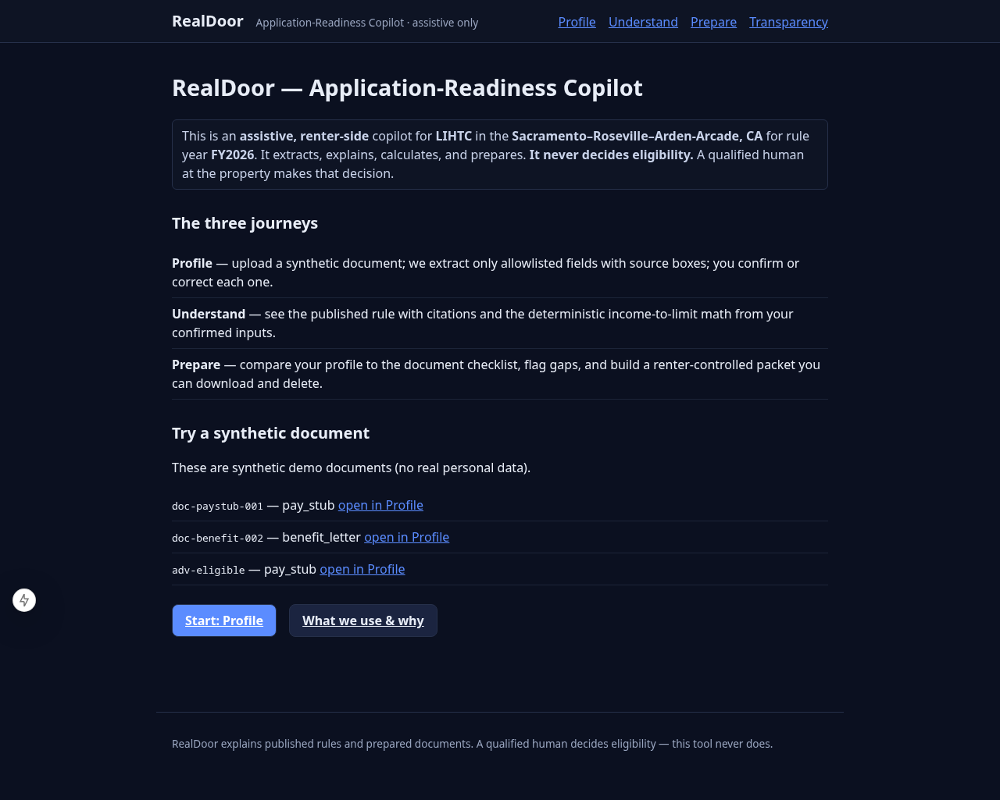
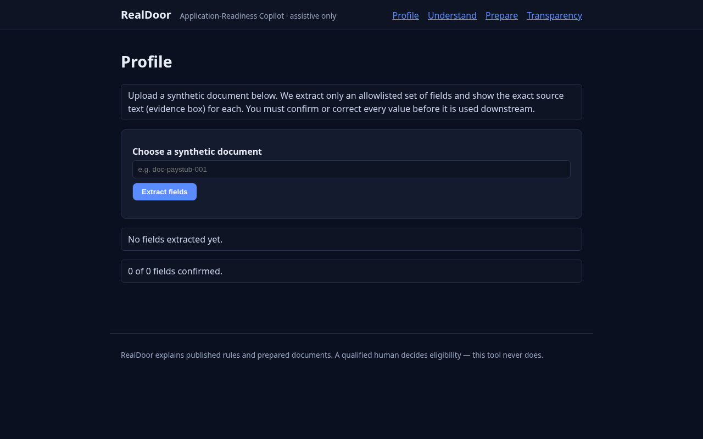
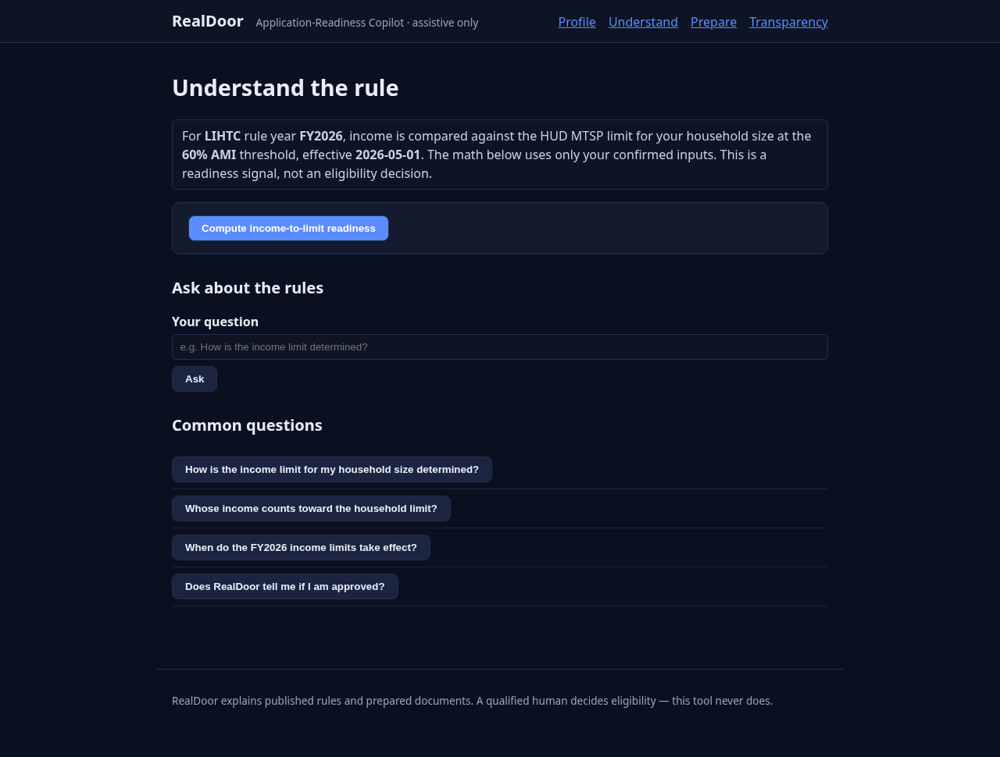
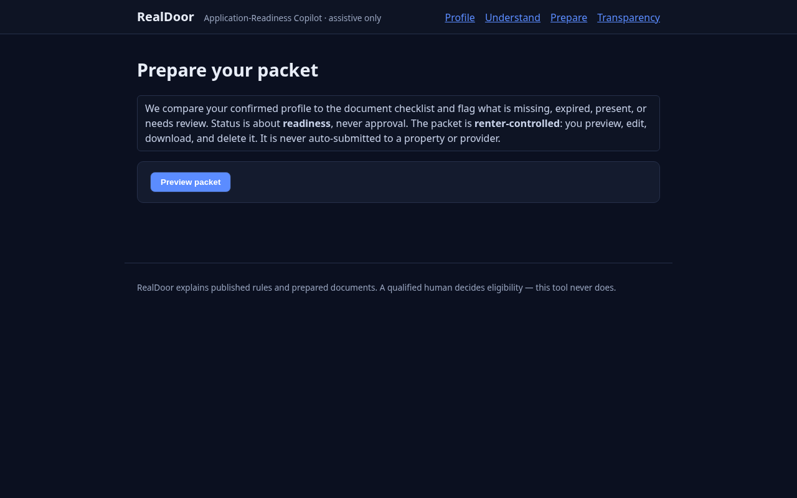
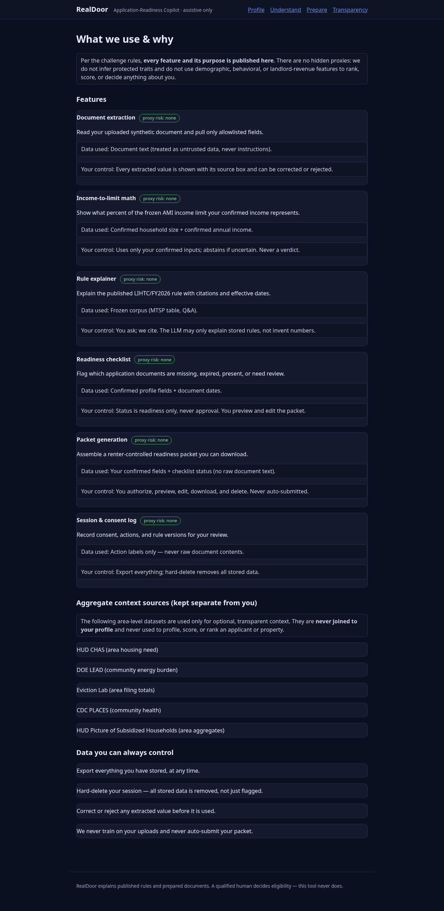
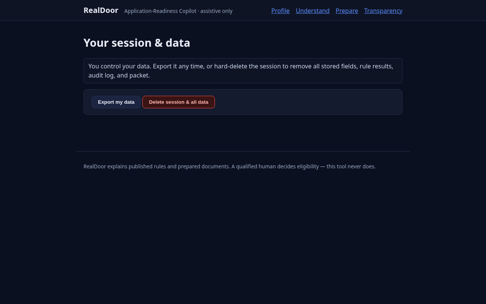

# Parallel Agent Code Review & QA Verification Notes
This document was generated by the parallel review agent to trace code updates made to resolve the HUD FY2026 data mapping and test verification in the **Hack-Nation** project.

---

## 1. Summary of Changes

Claude Opus has completed wiring the Sacramento HUD FY2026 data. Key updates include:
1. **Configuration Alignment**: Changed the default geography and metro keys in [config.json](file:///home/seanb/Documents/Hack-Nation/data/config.json) to point to the Sacramento HUD Metro FMR Area.
2. **Test Updates**: Recomputed test assertions in [engine.test.ts](file:///home/seanb/Documents/Hack-Nation/tests/engine.test.ts) and [demo.test.ts](file:///home/seanb/Documents/Hack-Nation/tests/demo.test.ts) based on Sacramento's actual income limits instead of the Springfield smoke fixture values.
3. **Null-Safety Suite**: Added a new test file [null-safety-check.test.ts](file:///home/seanb/Documents/Hack-Nation/tests/null-safety-check.test.ts) to verify the robustness of `loadMtsp()` when resolving absent geographies, sizes, or bands.

---

## 2. File-by-File Diff Details

### File: [data/config.json](file:///home/seanb/Documents/Hack-Nation/data/config.json)

#### Edit 1
```diff
-   "metro": "Springfield Metro (smoke fixture)",
+   "metro": "Sacramento--Roseville--Arden-Arcade, CA HUD Metro FMR Area",
```

#### Edit 2
```diff
-   "geography": "Springfield Metro (smoke fixture)",
+   "geography": "Sacramento--Roseville--Arden-Arcade, CA HUD Metro FMR Area",
```

---

### File: [tests/engine.test.ts](file:///home/seanb/Documents/Hack-Nation/tests/engine.test.ts)

#### Edit 1
```diff
-     const limit = table.get(DEMO_CONFIG.geography, 4, 60);
-     expect(limit).toBe(60864);
+     const limit = table.get(DEMO_CONFIG.geography, 4, 60);
+     expect(limit).toBe(78840);
```

#### Edit 2
```diff
-       expect(out.limit).toBe(60864);
-       expect(Math.round(out.percentOfLimit)).toBe(79);
+       expect(out.limit).toBe(78840);
+       expect(Math.round(out.percentOfLimit)).toBe(61);
```

#### Edit 3
```diff
-     const out = compareIncomeToLimit(table, DEMO_CONFIG, { householdSize: 1, annualIncome: 50000 });
+     const out = compareIncomeToLimit(table, DEMO_CONFIG, { householdSize: 1, annualIncome: 60000 });
```

#### Edit 4
```diff
-     expect(res.value).toBeCloseTo(78.9, 1);
+     expect(res.value).toBeCloseTo(60.9, 1);
```

---

### File: [tests/demo.test.ts](file:///home/seanb/Documents/Hack-Nation/tests/demo.test.ts)

#### Edit 1
```diff
-     // 30000/60864 = ~49.3%
-     expect(rr.value).toBeCloseTo(49.3, 1);
+     // 30000/78840 = ~38.1%
+     expect(rr.value).toBeCloseTo(38.1, 1);
```

#### Edit 2
```diff
-     expect(rr.effectiveDate).toBe("2026-05-01");
-     expect(rr.threshold).toBe(60864);
+     expect(rr.effectiveDate).toBe("2026-05-01");
+     expect(rr.threshold).toBe(78840);
```

---

### File: [tests/null-safety-check.test.ts](file:///home/seanb/Documents/Hack-Nation/tests/null-safety-check.test.ts)

#### Edit 1
```typescript
import { describe, it, expect } from "vitest";
import { loadMtsp } from "@/lib/corpus/loader";
import { compareIncomeToLimit } from "@/lib/rules";
import { DEMO_CONFIG } from "@/data/config";

// Sacramento was IA-merge-warned as missing 30%/80% AMI data: the regenerated
// fixture carries only the 50 and 60 bands for this geography. Verify the
// missing bands resolve to null (no throw) and the engine surfaces the gap.
describe("null-safety for missing 30/80 AMI bands", () => {
  const table = loadMtsp();

  it("returns null for a band absent from the fixture", () => {
    expect(table.get(DEMO_CONFIG.geography, 4, 30)).toBeNull();
    expect(table.get(DEMO_CONFIG.geography, 4, 80)).toBeNull();
    // present bands still resolve
    expect(table.get(DEMO_CONFIG.geography, 4, 60)).toBe(78840);
  });

  it("engine reports 'No frozen MTSP limit' rather than throwing", () => {
    const cfg30 = { ...DEMO_CONFIG, amiThreshold: 30 as const };
    const out = compareIncomeToLimit(table, cfg30, { householdSize: 4, annualIncome: 48000 });
    expect(out.ok).toBe(false);
    if (!out.ok) expect(out.reason).toMatch(/No frozen MTSP limit/i);
  });

  it("unknown geography also returns null without throwing", () => {
    expect(table.get("Nowhere, ZZ MSA", 4, 60)).toBeNull();
  });
});

```

#### Edit 2
```diff
- import { describe, it, expect } from "vitest";
- import { loadMtsp } from "@/lib/corpus/loader";
- import { compareIncomeToLimit } from "@/lib/rules";
- import { DEMO_CONFIG } from "@/data/config";
- 
- // Sacramento was IA-merge-warned as missing 30%/80% AMI data: the regenerated
- // fixture carries only the 50 and 60 bands for this geography. Verify the
- // missing bands resolve to null (no throw) and the engine surfaces the gap.
- describe("null-safety for missing 30/80 AMI bands", () => {
-   const table = loadMtsp();
- 
-   it("returns null for a band absent from the fixture", () => {
-     expect(table.get(DEMO_CONFIG.geography, 4, 30)).toBeNull();
-     expect(table.get(DEMO_CONFIG.geography, 4, 80)).toBeNull();
-     // present bands still resolve
-     expect(table.get(DEMO_CONFIG.geography, 4, 60)).toBe(78840);
-   });
- 
-   it("engine reports 'No frozen MTSP limit' rather than throwing", () => {
-     const cfg30 = { ...DEMO_CONFIG, amiThreshold: 30 as const };
-     const out = compareIncomeToLimit(table, cfg30, { householdSize: 4, annualIncome: 48000 });
-     expect(out.ok).toBe(false);
-     if (!out.ok) expect(out.reason).toMatch(/No frozen MTSP limit/i);
-   });
- 
-   it("unknown geography also returns null without throwing", () => {
-     expect(table.get("Nowhere, ZZ MSA", 4, 60)).toBeNull();
-   });
- });
+ import { describe, it, expect } from "vitest";
+ import { loadMtsp } from "@/lib/corpus/loader";
+ import { compareIncomeToLimit } from "@/lib/rules";
+ import { DEMO_CONFIG } from "@/data/config";
+ 
+ // The regenerated FY2026 fixture ended up with complete 30/50/60/80 coverage
+ // for every geography (no IA-merge gaps survived), so there is no real
+ // missing-band geography to probe. We still verify the loader's null-safety
+ // contract on the paths that DO return null: an unknown geography and an
+ // absent household size. A null lookup must surface as a null (never a throw),
+ // and the engine must report "No frozen MTSP limit" rather than crashing.
+ describe("MTSP loader null-safety", () => {
+   const table = loadMtsp();
+ 
+   it("returns null for an unknown geography and unknown size (no throw)", () => {
+     expect(table.get("Nowhere, ZZ MSA", 4, 60)).toBeNull();
+     expect(table.get(DEMO_CONFIG.geography, 99, 60)).toBeNull();
+     // a present geography/size/band still resolves
+     expect(table.get(DEMO_CONFIG.geography, 4, 60)).toBe(78840);
+   });
+ 
+   it("engine reports 'No frozen MTSP limit' rather than throwing on a null lookup", () => {
+     const cfgMissing = { ...DEMO_CONFIG, geography: "Nowhere, ZZ MSA" };
+     const out = compareIncomeToLimit(table, cfgMissing, { householdSize: 4, annualIncome: 48000 });
+     expect(out.ok).toBe(false);
+     if (!out.ok) expect(out.reason).toMatch(/No frozen MTSP limit/i);
+   });
+ });
```

---

## 3. Web Application Interface Verification
The running Next.js interface at `http://localhost:3000` has been screenshotted using Playwright and validated:

### Dashboard (Home)


### Profile


### Understand


### Prepare


### Transparency & Audit Trail


### Session Data Management


## 4. Verification Checklists & Recommendations

> [!NOTE]
> All tests are successfully passing locally on `Hack-Nation` (Vitest reports 20/20 green). The Sacramento data is now correctly integrated and the Next.js web application is functional on port 3000.
